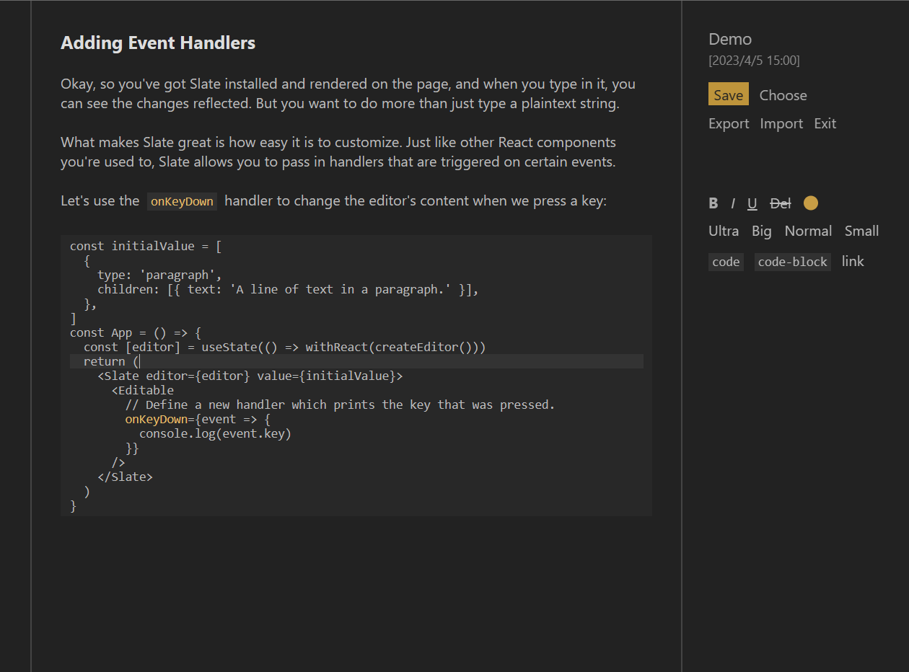
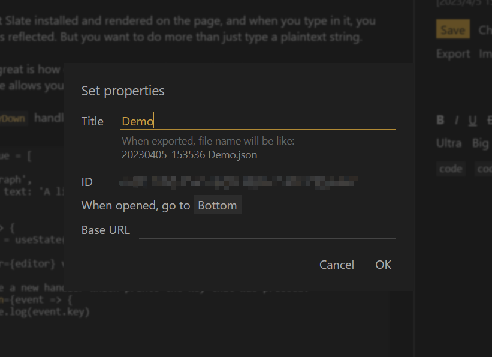

## - oustr -

Someone who enjoys front-end development.

Welcome to my site <a href="https://oustr.github.io/">oustr.github.io</a> and discover the following features:

<h3>Intertext (mobile) </h3>

A web app for creating "chat-logs"

    

        
        
    

    

        
        
    

<h3>Sculpt (desktop) </h3>

A rich-text editor made with Slate.js framework

    

        
    

    

        
    

