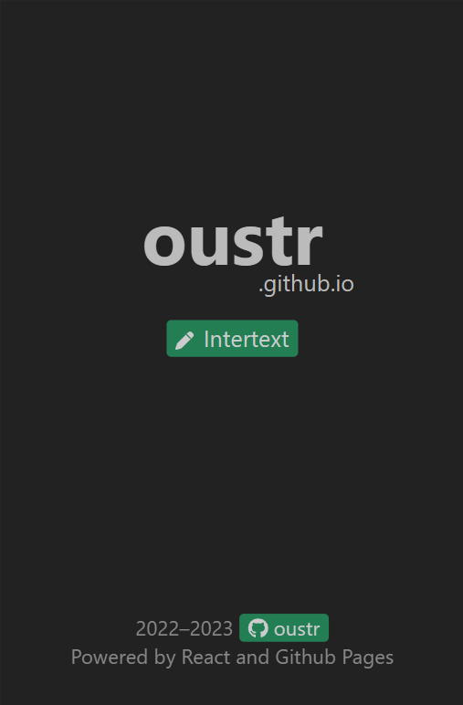
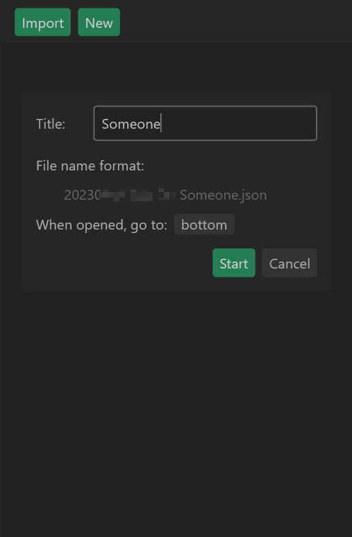
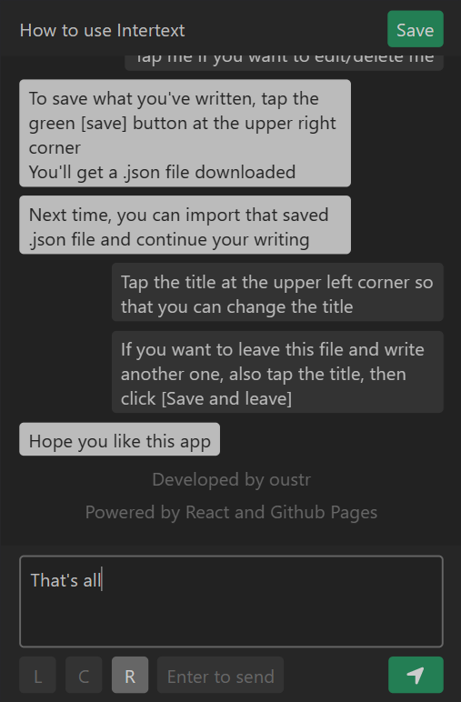
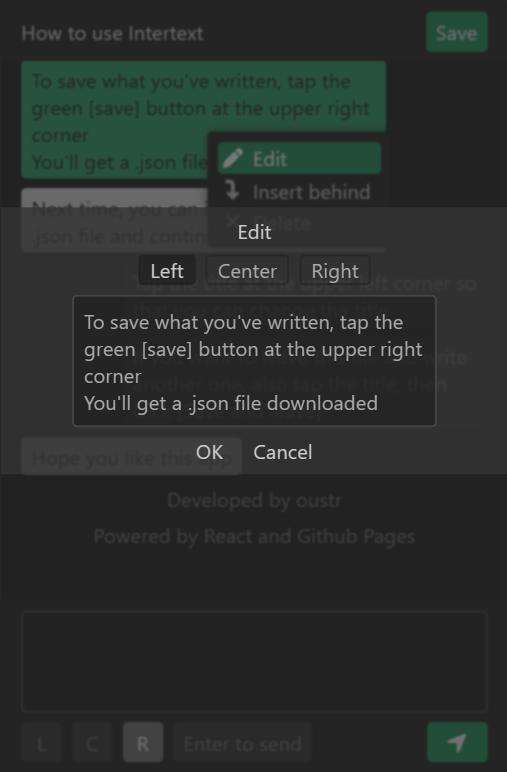
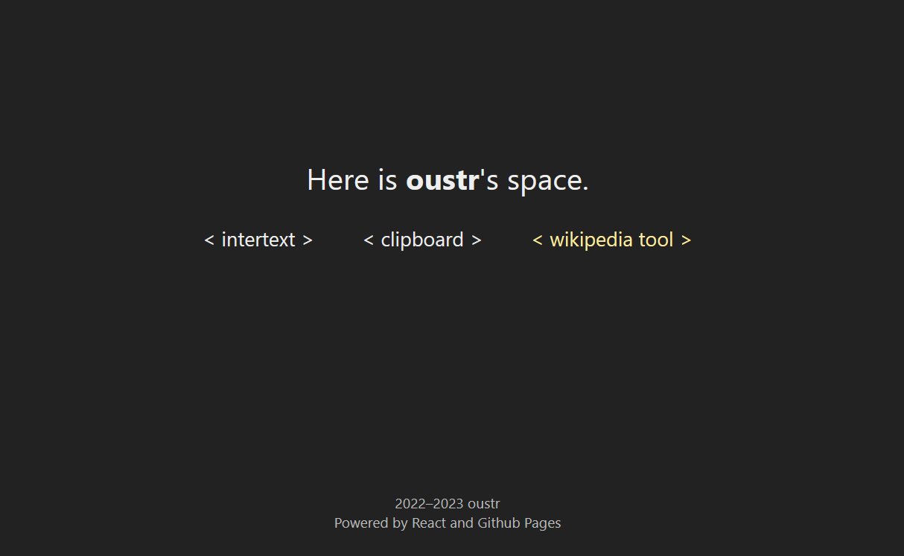
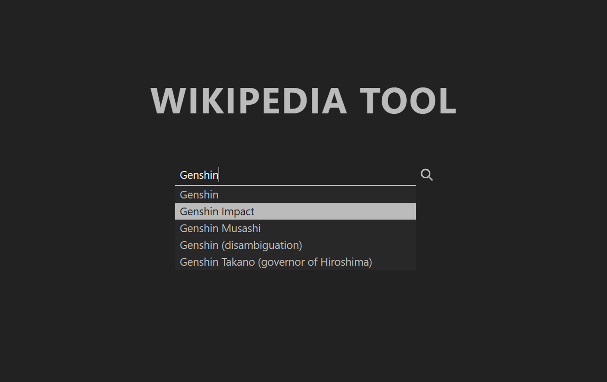
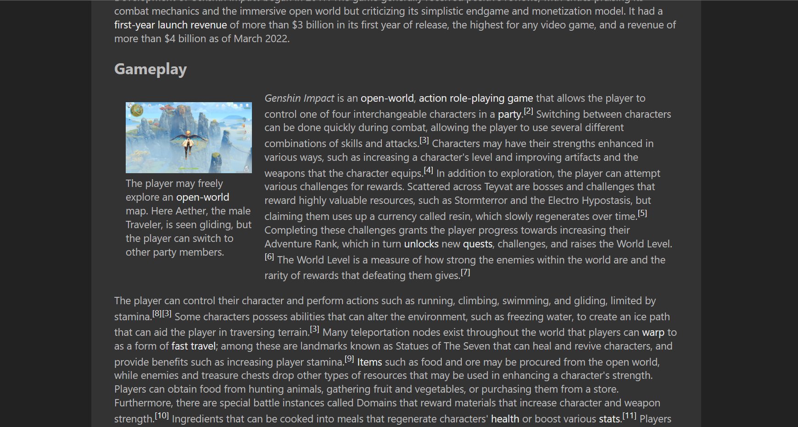

## - oustr -

An undergraduate student who's exploring Front-end development. Welcome to my site <a href="https://oustr.github.io/">oustr.github.io</a> powered by React and discover these features:

<h3>Intertext (mobile)</h3>

    
    
    
    

<h3>Wikipedia tool (desktop)</h3>

    
    
    

